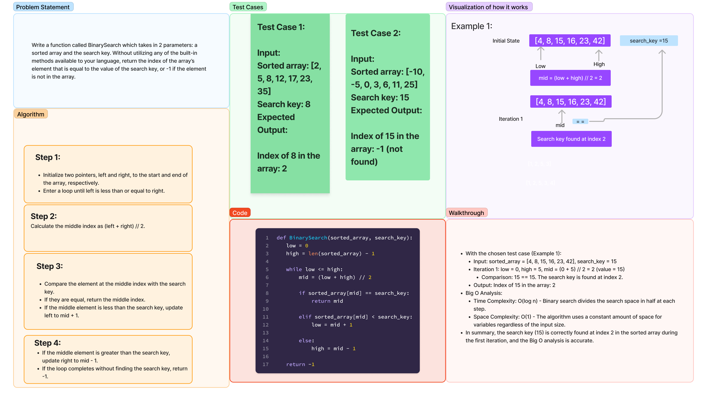

# Array Binary Search

## Authors: Stephanie G. Johnson & Ekow Yawson & Latherio Kidd

(We worked as a team on this assignment.)

## Overview

Implement a function called `BinarySearch` that takes in a sorted array and a search key. The function returns the index of the array’s element that is equal to the value of the search key. If the element is not in the array, it returns -1.

## Whiteboard Process



[Code](array_binary.py)

## Approach & Efficiency

For the `BinarySearch` function:

- Initialize two pointers, `low` and `high`, to the start and end of the array, respectively.
- Enter a loop until `low` is less than or equal to `high`.
- Calculate the middle index as `(low + high) // 2`.
- Compare the element at the middle index with the search key.
  - If they are equal, return the middle index.
  - If the middle element is less than the search key, update `low` to `mid + 1`.
  - If the middle element is greater than the search key, update `high` to `mid - 1`.
- If the loop completes without finding the search key, return -1.

**Time Complexity:** O(log n) - Binary search divides the search space in half at each step.

**Space Complexity:** O(1) - The algorithm uses a constant amount of space for variables regardless of the input size.

## Example

```python
from binary_search import BinarySearch

sorted_array = [1, 2, 3, 4, 5, 6, 7, 8, 9, 10]
search_key = 7
result = BinarySearch(sorted_array, search_key)
print(f"Index of {search_key} in the array:", result)  # Output: Index of 7 in the array: 6
```

This example demonstrates the usage of the `BinarySearch` function with a sorted array and a search key, returning the index of the key in the array or -1 if not found.

Resource: ChatGPT
