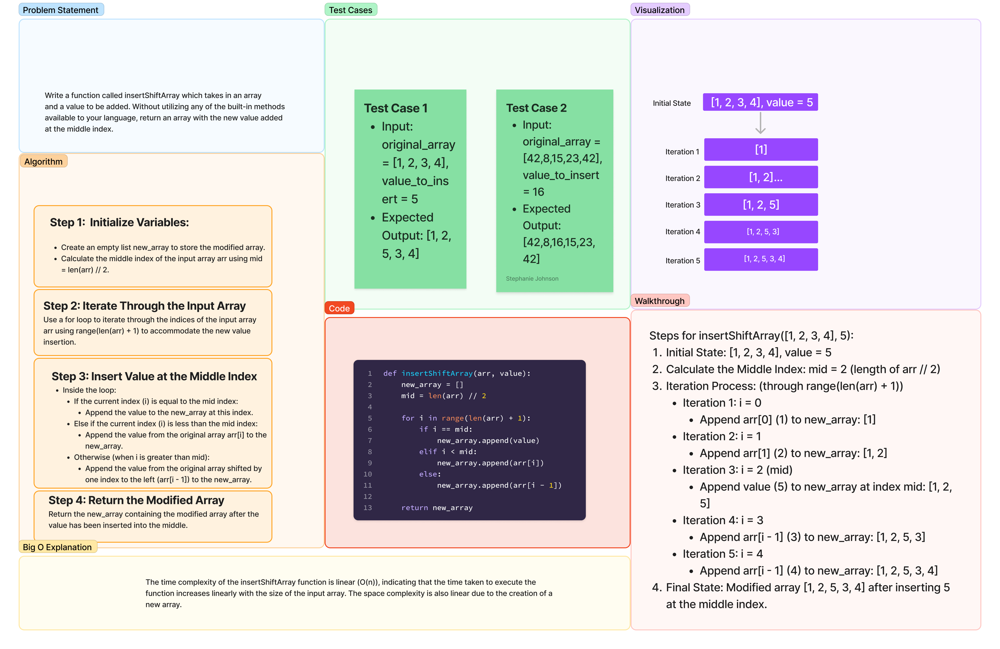

# Array_Insert_Shift

Write a function called insertShiftArray which takes in an array and a value to be added. Without utilizing any of the built-in methods available to your language, return an array with the new value added at the middle index.

## Whiteboard Process


[Link to Code](array_insert_shift.py)

## Example Input & Output

Input: `[2,4,6,-8], 5`
Output: `[2,4,5,6,-8]`

Input: `[42,8,15,23,42], 16`
Output: `[42,8,16,15,23,42]`

## Approach & Efficiency

The `insertShiftArray` function was designed to insert a value into the middle of an array while maintaining the original order of elements. Here's the approach used to create the function and the rationale behind it:

### Approach:

1. **Identify the Middle Index:**
   - The function calculates the middle index of the input array to determine where the value needs to be inserted.

2. **Iterate Through the Array:**
   - It uses a `for` loop to traverse the original array.
   - During the iteration, it constructs a new array (`new_array`) by inserting the value at the calculated middle index and shifting subsequent elements accordingly.

3. **Insertion Logic:**
   - If the current index matches the middle index, the value is appended to the `new_array`.
   - For indices before the middle, values from the original array are appended as-is.
   - For indices after the middle, values from the original array are shifted one position to the right and then appended to `new_array`.

### Rationale:

- **Maintaining Order:** The approach was chosen to ensure that the function maintains the original order of elements while inserting a new value into the middle.

- **Simplicity and Readability:** The logic used in the function aims for simplicity and readability by employing a clear iteration process and conditional statements to handle the insertion logic step-by-step.

- **Handling Edge Cases:** The function accounts for varying input array lengths by calculating the middle index dynamically, enabling it to work with arrays of different sizes.

- **Efficiency:** While the function effectively achieves its goal of inserting a value into the middle of an array, the time complexity for larger arrays (O(n)) might impact efficiency. However, for relatively small arrays, this approach is straightforward and doesn't significantly affect performance.

Overall, the chosen approach was based on a balance between simplicity, readability, and handling the specific task requirements of inserting a value into the middle of an array.

The Big O analysis for the `insertShiftArray` function involves evaluating the time complexity of the algorithm in terms of its efficiency as the size of the input array (`arr`) grows.

### Time Complexity Analysis:

1. **Calculating the Middle Index:**
   - This step involves a constant-time operation (`mid = len(arr) // 2`). It doesn't vary with the input size. Time Complexity: O(1)

2. **Iteration through the Array:**
   - The `for` loop iterates through the entire input array (`arr`) once.
   - The loop performs a constant-time operation for each iteration, which involves appending elements to the `new_array`.
   - Asymptotic Complexity: O(n), where 'n' is the size of the input array (`len(arr)`)

### Overall Time Complexity:

   - Considering both steps together:
     - The constant-time operation for calculating the middle index doesn't significantly impact the overall time complexity.
     - The dominant factor is the linear iteration through the input array, leading to a time complexity of O(n), where 'n' represents the size of the input array.

### Space Complexity:

   - The function utilizes additional space for creating a new array (`new_array`) to hold the modified elements.
   - Space Complexity: O(n), where 'n' is the size of the input array, as the space required is directly proportional to the input size.

In summary, the time complexity of the `insertShiftArray` function is linear (O(n)), indicating that the time taken to execute the function increases linearly with the size of the input array. The space complexity is also linear due to the creation of a new array.

Reference: ChatGPT

## Solution
<!-- Show how to run your code, and examples of it in action -->
### Steps to Run:

1. **Using Python Interpreter:**
   - Save the code in a `.py` file (e.g., `insert_shift_array.py`).
   - Open a terminal or command prompt.
   - Navigate to the directory containing the `.py` file.
   - Run the file using `python insert_shift_array.py`.

2. **Using an IDE:**
   - Open the code in your preferred IDE.
   - Run the script by executing it within the IDE.


### Example Code:

```python
def insertShiftArray(arr, value):
    new_array = []
    mid = len(arr) // 2

    for i in range(len(arr) + 1):
        if i == mid:
            new_array.append(value)
        elif i < mid:
            new_array.append(arr[i])
        else:
            new_array.append(arr[i - 1])

    return new_array

# Example Usage
original_array = [1, 2, 3, 4]
value_to_insert = 5

result = insertShiftArray(original_array, value_to_insert)
print(f"Modified Array: {result}")
```

### Example Output:

For the provided example code, the output will be:

```
Modified Array: [1, 2, 5, 3, 4]
```

This output demonstrates the modified array after inserting `5` into the middle of the original array `[1, 2, 3, 4]`. You can modify the `original_array` and `value_to_insert` variables to test the function with different inputs and observe the resulting modified array.

Reference: ChatGPT
