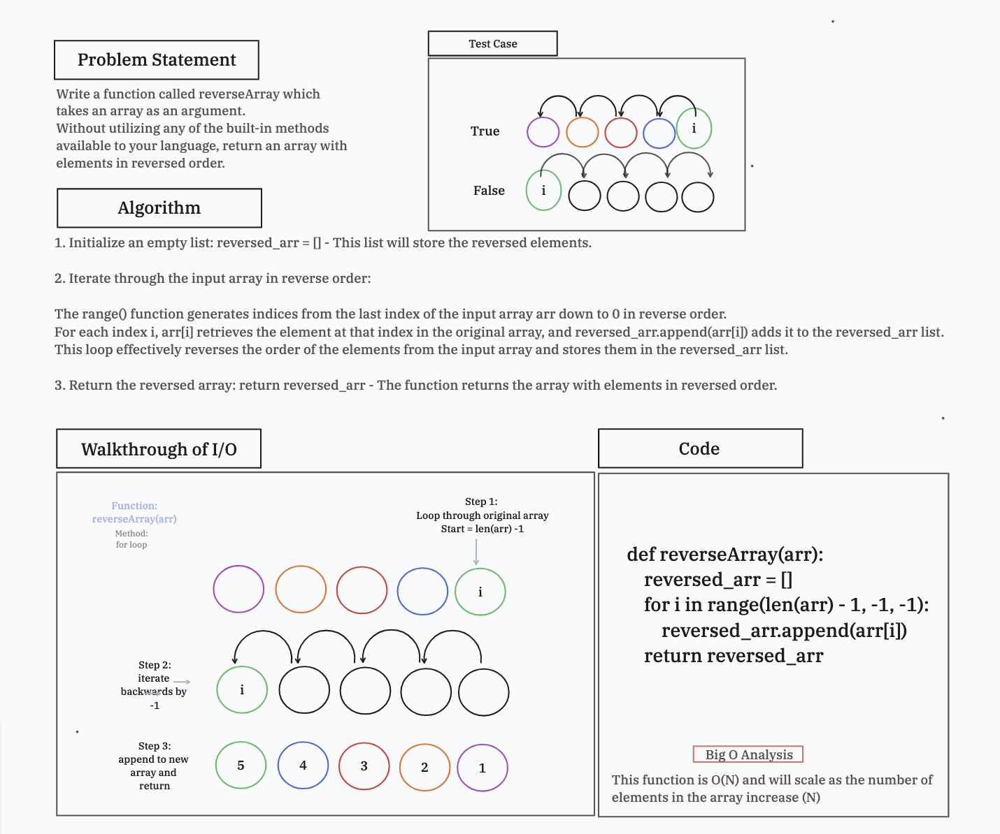

# Array Reverse

Write a function called reverseArray which takes an array as an argument. Without utilizing any of the built-in methods available to your language, return an array with elements in reversed order.

## Whiteboard Process



## Link to Code

[Code Link](array_reverse.py)

[Test Link](test_reverse_array.py)

## Approach & Efficiency

Method: for loop

Reason: not a built in function like alternatives - reverse, slice, and pop

Approach: The code defines a function `reverseArray` that takes an input list (`arr`) and returns a new list containing the elements of the input list in reverse order.
The function iterates through the input array arr in reverse order using a for loop and appends each element to a new list reversed_arr.

Efficiency:

Time Complexity: O(N) - The function iterates through the entire array once, performing N operations, where N is the number of elements in the input array.

Space Complexity: O(N) - The function creates a new list reversed_arr with N elements, where N is the size of the input array.

## Solution

```python
def reverseArray(arr):
    reversed_arr = []
    for i in range(len(arr) - 1, -1, -1):
        reversed_arr.append(arr[i])
    return reversed_arr

# Test Cases

def test_results_neg():
    arr = [89, 2354, 3546, 23, 10, -923, 823, -12]
    expected = [-12, 823, -923, 10, 23, 3546, 2354, 89]
    actual = reverseArray(arr)
    assert actual == expected

def sir_test_a_lot():
    arr = [2, 3, 5, 7, 11, 13, 17, 19, 23, 29, 31, 37, 41, 43, 47, 53, 59, 61, 67, 71, 73, 79, 83, 89, 97, 101, 103, 107, 109, 113, 127, 131, 137, 139, 149, 151, 157, 163, 167, 173, 179, 181, 191, 193, 197, 199]
    expected = [199, 197, 193, 191, 181, 179, 173, 167, 163, 157, 151, 149, 139, 137, 131, 127, 113, 109, 107, 103, 101, 97, 89, 83, 79, 73, 71, 67, 61, 59, 53, 47, 43, 41, 37, 31, 29, 23, 19, 17, 13, 11, 7, 5, 3, 2]
    actual = reverseArray(arr)
    assert actual == expected
```

## Resources

- ChatGPT

- [reverse lists](https://favtutor.com/blogs/reverse-list-python)

- TA Tammy

Date: 1/8/24
