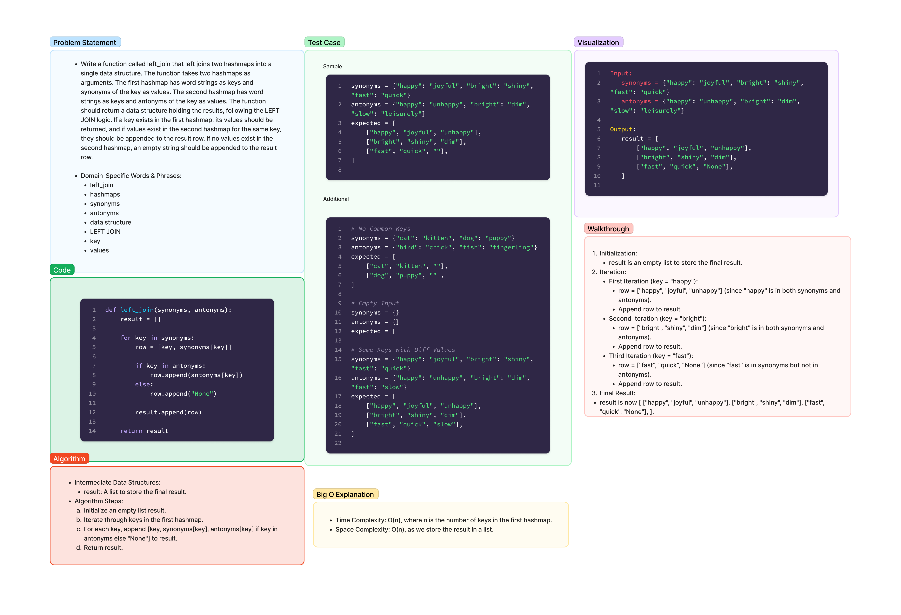

# Code Challenge 33: Hash Table Implementation

Date: 2.21.24

Author:
**Stephanie G. Johnson**

Collaborators:

Ekow Yawson

Latherio Kidd

## Challenge Description

Implement a left join operation on two hash tables. The goal is to combine key-value pairs from two hash tables based on the left join logic.

## Whiteboard Process



[Link to Code](../../code_challenges/hashtable_left_join.py)

## Approach & Efficiency

### Approach

- Iterate through the keys in the first hash table.
- For each key, create a row containing the key and its value from the first hash table.
- Check if the key is present in the second hash table.
  - If yes, append the corresponding value from the second hash table to the row.
  - If no, append "None" to the row.
- Append each row to the result list.

### Efficiency

- Time Complexity: O(n), where n is the number of keys in the first hash table.
- Space Complexity: O(n), considering the space required for the result list.

## Solution & Usage

### Examples

```python
synonyms = {"happy": "joyful", "bright": "shiny", "fast": "quick"}
antonyms = {"happy": "unhappy", "bright": "dim", "slow": "leisurely"}
left_join_result = left_join(synonyms, antonyms)
# Output: [['happy', 'joyful', 'unhappy'], ['bright', 'shiny', 'dim'], ['fast', 'quick', 'None']]
```

## Methods

```python
def left_join(synonyms, antonyms):
    """
    Perform a left join operation on two hash tables.

    Args:
    - synonyms (dict): The first hash table with word strings as keys and synonyms as values.
    - antonyms (dict): The second hash table with word strings as keys and antonyms as values.

    Returns:
    - list: A list of lists containing key-value pairs from the left hash table and, if available,
            corresponding values from the right hash table. If no values exist in the right hash table,
            "None" is appended to the result row.
    """
    result = []

    for key in synonyms:
        row = [key, synonyms[key]]

        if key in antonyms:
            row.append(antonyms[key])
        else:
            row.append("None")

        result.append(row)

    return result
```

The `left_join` function takes two hash tables (`synonyms` and `antonyms`) and performs a left join operation. It iterates through the keys in the `synonyms` hash table, creating a row for each key containing the key itself and its corresponding value from the `synonyms` hash table. It then checks if the key is present in the `antonyms` hash table. If the key is present, the corresponding value from the `antonyms` hash table is appended to the row; otherwise, "None" is appended. The resulting rows are collected in a list and returned as the final output.

## Features

- The `left_join` function performs a left join on two hash tables.
- The result is a list of lists containing key-value pairs from the left hash table and, if available, corresponding values from the right hash table.

## Practical Purpose

- The left join operation can be useful in scenarios where you want to combine information from two datasets, ensuring that all entries from the left dataset are retained, and additional information from the right dataset is appended where available.
