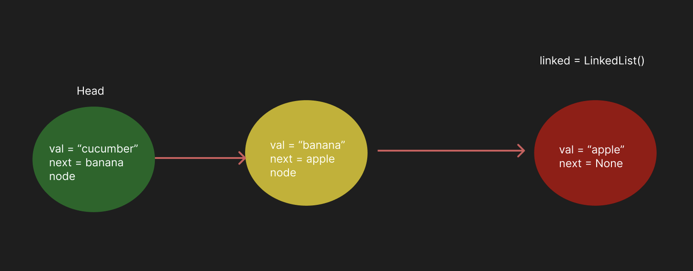

# Implementation: Singly Linked Lists

Create a Node class and LinkedList class that will have a singly linked list properties like adding element to the beginning of the linked list, check for the existence of the elemnt in the list and print all list elements as a string

## Author: Stephanie G. Johnson (1.12.24)

## Whiteboard Process




## Approach & Efficiency


### LinkedList Class:

1. **`Node` Class:**
   - The `Node` class represents a node in the linked list. It contains a `value` attribute to store the data and a `next` attribute as a reference to the next node in the list.

2. **`LinkedList` Class:**
   - The `LinkedList` class represents a singly linked list. It has a `head` attribute, which points to the first node in the list.
   - **Initialization (`__init__` method):**
     - Initializes an empty linked list with `self.head = None`.
   - **Insertion (`insert` method):**
     - Inserts a new node at the head of the list, creating a new node with the given value and updating the `head` to point to this new node.
   - **Search (`includes` method):**
     - Iterates through the list to check if a node with a given value exists. Returns `True` if found, otherwise `False`.
   - **String Representation (`__str__` method):**
     - Returns a string representation of the linked list, displaying values in the format "{ a } -> { b } -> { c } -> NULL".

### Example Usage:

```python
linked_list = LinkedList()
linked_list.insert(3)
linked_list.insert(2)
linked_list.insert(1)

print(linked_list.includes(2))  # True
print(linked_list.includes(4))  # False

print(linked_list)  # "{ 1 } -> { 2 } -> { 3 } -> NULL"
```

### Approach and Efficiency:

1. **Insertion (`insert` method):**
   - The insertion operation has a time complexity of O(1) because it adds a new node at the head of the list.

2. **Search (`includes` method):**
   - The search operation has a time complexity of O(n) in the worst case, where n is the number of nodes in the linked list. This is because it iterates through the list until it finds the node with the given value or reaches the end.

3. **String Representation (`__str__` method):**
   - The string representation operation has a time complexity of O(n) as it iterates through all nodes in the list to create the formatted string.

4. **Space Complexity:**
   - The space complexity of the linked list is O(n), where n is the number of nodes in the list. This is because it uses additional memory for storing nodes.


## Solution
<!-- Show how to run your code, and examples of it in action -->

