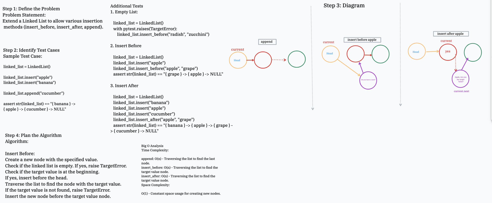

# Linked List Insertions

Challenge Type: Extend a Linked List to allow various insertion methods.

Date: 1/16/2024

## Whiteboard Process



[The Code](insertion.py)

[The Tests](../../tests/code_challenges/test_linked_list_insertions.py)

## Approach & Efficiency

For the insertion methods in the Linked List, I followed these approaches:

### 1. `append(new_value)`

- **Algorithm:**

  1. Create a new node with the given `new_value`.
  2. If the linked list is empty (head is `None`), set the head to the new node.
  3. Otherwise, traverse the list until the last node is reached.
  4. Set the `next` of the last node to the new node.

- **Time Complexity:** O(n), where n is the number of nodes in the list (as it may need to traverse the entire list).

### 2. `insert_before(target_value, new_value)`

- **Algorithm:**

  1. Create a new node with the given `new_value`.
  2. If the linked list is empty, raise a `TargetError` since you cannot insert before in an empty list.
  3. If the target value is found at the beginning (head node), insert the new node before the current head and update the head pointer.
  4. Otherwise, traverse the list to find the node with the target value.
  5. If the target value is not found, raise a `TargetError`.
  6. Insert the new node before the node with the target value.

- **Time Complexity:** O(n), where n is the number of nodes in the list (as it may need to traverse the entire list to find the target value).

### 3. `insert_after(target_value, new_value)`

- **Algorithm:**

  1. Create a new node with the given `new_value`.
  2. If the linked list is empty, raise a `TargetError` since you cannot insert after in an empty list.
  3. Traverse the list to find the node with the target value.
  4. If the target value is not found, raise a `TargetError`.
  5. Insert the new node after the node with the target value.

- **Time Complexity:** O(n), where n is the number of nodes in the list (as it may need to traverse the entire list to find the target value).

## Example Usage

To use the code, follow these steps:

1. Open the `insertion.py` file.
2. Import the `LinkedList` class.
3. Create an instance of the `LinkedList`.
4. Use the various insertion methods (`append`, `insert_before`, `insert_after`) on the instance.

Example:

```python
from insertion import LinkedList

# Create a linked list
linked_list = LinkedList()

# Append values
linked_list.append(1)
linked_list.append(3)

# Insert before
linked_list.insert_before(3, 2)

# Insert after
linked_list.insert_after(1, 5)

# Print the linked list
print(linked_list)
```

This example creates a linked list, appends values, inserts a value before another, and inserts a value after another. The `print(linked_list)` statement displays the final state of the linked list.

For more examples and detailed explanations, refer to the [tests](../../tests/code_challenges/test_linked_list_insertions.py).
