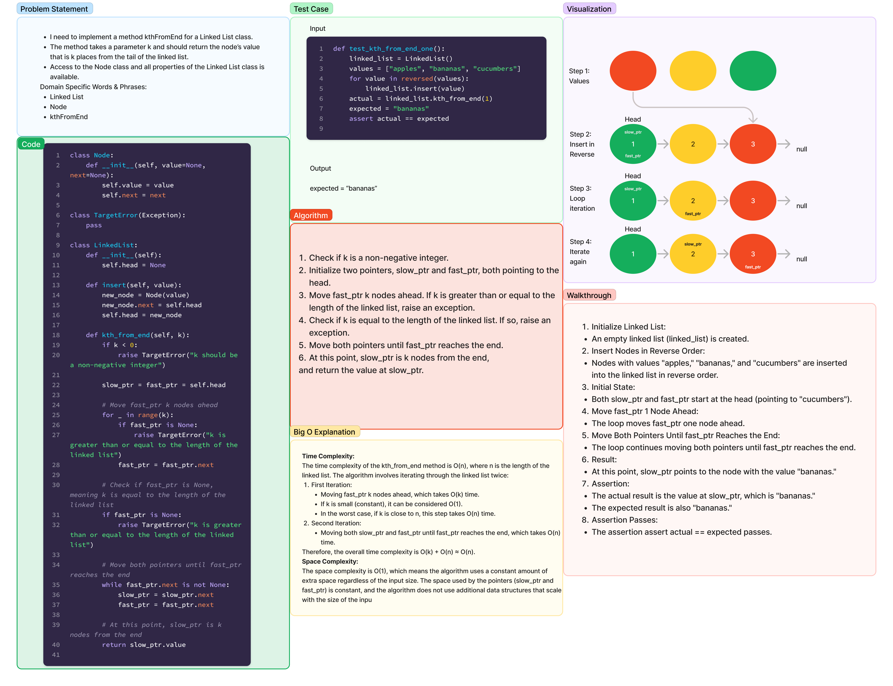

# Adding a Node to the k-th Position of a Linked List

1.17.24

Write the following method for the Linked List class:
k-th value from the end of a linked list.
  argument: a number, k, as a parameter.
  Return the node’s value that is k places from the tail of the linked list.

## Whiteboard Process



[Code](linked_list_kth.py)

[Tests](../../tests/code_challenges/test_linked_list_kth.py)

## Approach & Efficiency
In this solution, we used two pointers, `slow_ptr` and `fast_ptr`, to traverse the linked list. The `fast_ptr` is initially moved k nodes ahead, and then both pointers are moved simultaneously until `fast_ptr` reaches the end of the list. At this point, `slow_ptr` is at the k-th node from the end.

### Time Complexity
The time complexity of this solution is O(n), where n is the length of the linked list. This is because we iterate through the linked list twice.

### Space Complexity
The space complexity is O(1), indicating a constant amount of extra space regardless of the input size.

## Solution
To run the code, you can use the provided `LinkedList` class and call the `kth_from_end` method with the desired value of k. Here's an example:

```python
linked_list = LinkedList()
values = ["apples", "bananas", "cucumbers"]
for value in reversed(values):
    linked_list.insert(value)

kth_value = linked_list.kth_from_end(1)
print(kth_value)  # Output: "bananas"
```

This example demonstrates creating a linked list with values "apples," "bananas," and "cucumbers," and then finding the value that is 1 place from the tail of the linked list.

