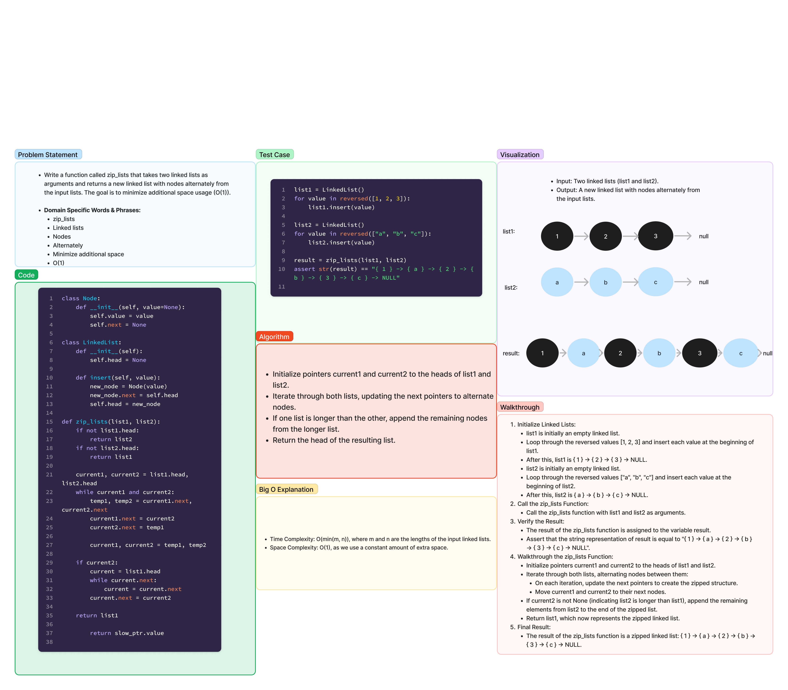

# Linked List Zip

1.19.24

## Overview

Implement a function called `zip_lists` that takes two linked lists as arguments and returns a new linked list with nodes alternately from the input lists. The goal is to minimize additional space usage (O(1)).

## API

### `zip_lists(list1, list2)`

Takes two linked lists (`list1` and `list2`) as arguments and returns a new linked list with nodes alternating between the two input lists.

- Input: `list1` - the first linked list.
- Input: `list2` - the second linked list.
- Output: Returns a reference to the zipped linked list.

## Whiteboard



[Code](../../code_challenges/linked_list_zip.py)

[Tests](../../tests/code_challenges/test_linked_list_zip.py)

## Approach & Efficiency

**Approach:**

The approach to solving the linked list zip problem involves traversing both input linked lists simultaneously, alternating nodes between them to create the zipped linked list. We use pointers to keep track of the current nodes in each list and iteratively update their `next` pointers to form the zipped structure.

1. Initialize pointers `current1` and `current2` to the heads of the input lists.
2. Iterate through both lists, updating the `next` pointers to alternate nodes.
3. If one list is longer than the other, append the remaining nodes from the longer list to the zipped list.
4. Return the head of the zipped list.

**Efficiency:**

- Time Complexity: O(min(m, n)), where m and n are the lengths of the input linked lists. We iterate through both lists once.
- Space Complexity: O(1), as we use a constant amount of extra space regardless of the input size. We perform the zipping in-place without using additional data structures.

This approach is efficient, especially in terms of space complexity, as it avoids the use of extra data structures. It performs the zipping operation directly on the input linked lists, minimizing the need for additional memory.

## Example

```python
from linked_list_zip import zip_lists, LinkedList

# Example usage:
list1 = LinkedList()
for value in reversed([1, 2, 3]):
    list1.insert(value)

list2 = LinkedList()
for value in reversed(["a", "b", "c"]):
    list2.insert(value)

result = zip_lists(list1, list2)

# Print the result
print(result)
```

Output:
```
{ 1 } -> { a } -> { 2 } -> { b } -> { 3 } -> { c } -> NULL
```

## Testing

pytest
