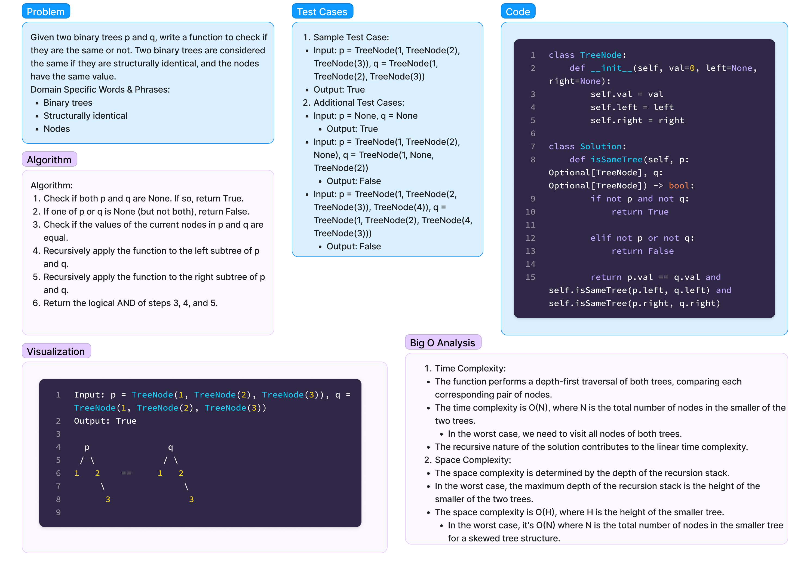

# Same Tree (Tree)- Challenge 36

Date: 2.26.2024

## Description

Given the roots of two binary trees p and q, write a function to check if they are the same or not.

Two binary trees are considered the same if they are structurally identical, and the nodes have the same value.


### Whiteboard

[Link to LeetCode](https://leetcode.com/problems/same-tree/submissions/1187082623/?envType=daily-question&envId=2024-02-26)

[Solution Code](../../code_challenges/same_tree.py)

[Tests](../../tests/code_challenges/test_same_tree.py)




## Approach & Efficiency

**Big-O Complexity for Time and Space**
- **Time Complexity:** O(N)
  - The function performs a depth-first traversal of both trees, comparing each corresponding pair of nodes.
- **Space Complexity:** O(H)
  - The space complexity is determined by the depth of the recursion stack.

## Solution & Usage

The solution involves a recursive approach, traversing the trees and comparing corresponding nodes.

## Examples

- **Example 1:**
  ```python
  p = TreeNode(1, TreeNode(2), TreeNode(3))
  q = TreeNode(1, TreeNode(2), TreeNode(3))
  assert Solution().isSameTree(p, q) == True
  ```

- **Example 2:**
  ```python
  p = TreeNode(1, TreeNode(2), TreeNode(3))
  q = TreeNode(1, TreeNode(2), None)
  assert Solution().isSameTree(p, q) == False
  ```

- **Example 3:**
  ```python
  p = TreeNode(1, TreeNode(2), TreeNode(3))
  q = TreeNode(1, TreeNode(2), TreeNode(4))
  assert Solution().isSameTree(p, q) == False
  ```

## Running Tests

```bash
pytest -k test_same_tree.py
```

### Resources

- [Link to LeetCode Problem](https://leetcode.com/problems/same-tree/)
