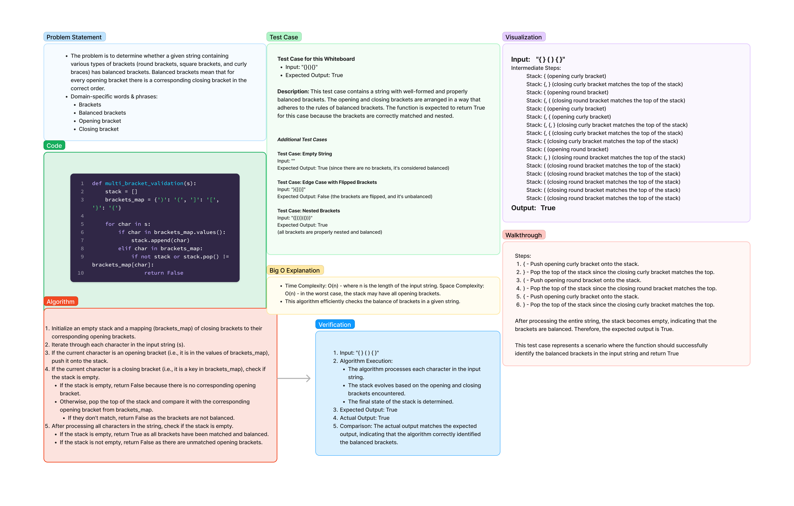

# Stack Queue Brackets

1.24.24

Write a function called validate brackets
Arguments: string
Return: boolean
representing whether or not the brackets in the string are balanced

## Whiteboard Process



[Link to Code](../../code_challenges/stack_queue_brackets.py)

## Approach & Efficiency:

**Approach:**

The approach taken is to use a stack to keep track of the opening brackets while iterating through the input string. For each closing bracket encountered, it is checked whether it matches the corresponding opening bracket on top of the stack. If the brackets are balanced, the stack is emptied by popping elements for each matched pair. The function returns `True` if the stack is empty at the end, indicating balanced brackets.

**Efficiency:**

- **Time Complexity:** O(n) - The algorithm iterates through each character in the input string once.
- **Space Complexity:** O(n) - In the worst case, the stack may have all opening brackets, leading to linear space usage.

## Solution:

**How to Run the Code:**

```python
def validate_brackets(s):
    stack = []
    brackets_map = {')': '(', ']': '[', '}': '{'}

    for char in s:
        if char in brackets_map.values():
            stack.append(char)
        elif char in brackets_map:
            if not stack or stack.pop() != brackets_map[char]:
                return False

    return not stack

# Example of the Function in Action
input_str = "({[]})"
output = validate_brackets(input_str)
print(output)  # Expected Output: True
```

**Examples:**

1. **Balanced Brackets:**
   ```python
   input_str = "({[]})"
   output = validate_brackets(input_str)
   print(output)  # Expected Output: True
   ```

2. **Unbalanced Brackets:**
   ```python
   input_str = "{[()]}"
   output = validate_brackets(input_str)
   print(output)  # Expected Output: False
   ```

3. **Empty String:**
   ```python
   input_str = ""
   output = validate_brackets(input_str)
   print(output)  # Expected Output: True
   ```

4. **Edge Case:**
   ```python
   input_str = "()"
   output = validate_brackets(input_str)
   print(output)  # Expected Output: True
   ```

**Note:**
- The function `validate_brackets` can be used with different input strings to check the balance of brackets. Here we used the character s.
- The function `validate_brackets` returns `True` if the brackets are balanced, and `False` if they are not.
- The examples demonstrate the function's ability to handle various cases, including balanced, unbalanced, empty strings, and edge cases.
