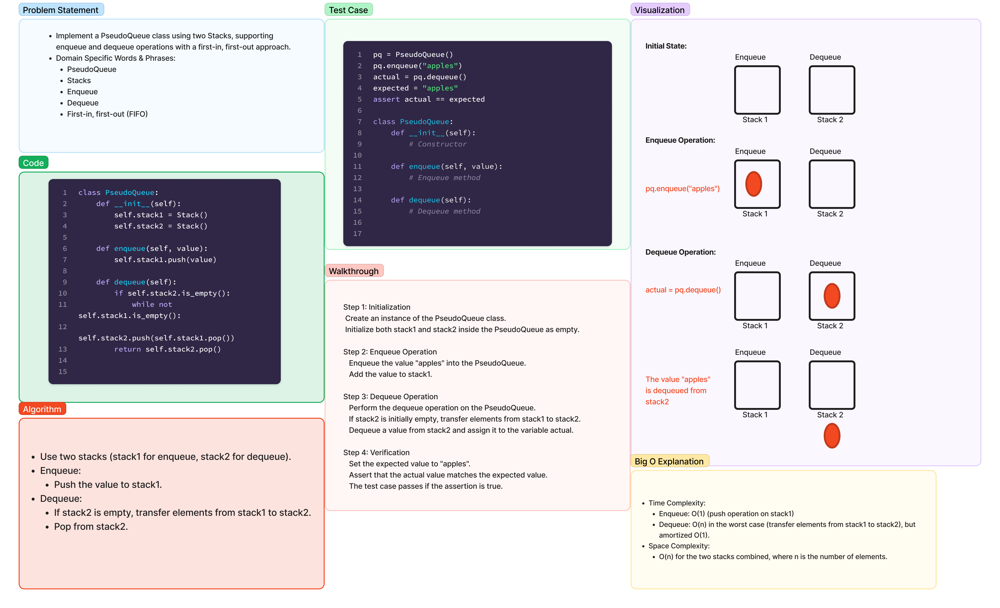

# Stack Queue Pseudo

Implement a Queue using two Stacks.

## Whiteboard Process



## Approach & Efficiency

### Approach

I implemented a PseudoQueue class using two Stacks (`stack1` and `stack2`). The `enqueue` operation involves transferring elements from `stack1` to `stack2` and then pushing a new value to `stack1`. The `dequeue` operation pops elements from `stack1`, ensuring a first-in, first-out (FIFO) approach.

### Efficiency

- **Time Complexity:**
  - Enqueue: O(n) in the worst case (transfer elements from `stack1` to `stack2`), but amortized O(1).
  - Dequeue: O(1) (pop operation on `stack1`).

- **Space Complexity:**
  - O(n) for the two stacks combined, where n is the number of elements.

## Solution

To use the PseudoQueue class, create an instance and perform enqueue and dequeue operations as follows:

```python
from code_challenges.stack_queue_pseudo import PseudoQueue

# Create an instance of PseudoQueue
pseudo_queue = PseudoQueue()

# Enqueue values
pseudo_queue.enqueue(10)
pseudo_queue.enqueue(15)
pseudo_queue.enqueue(20)

# Dequeue values
print(pseudo_queue.dequeue())  # Output: 10
print(pseudo_queue.dequeue())  # Output: 15
