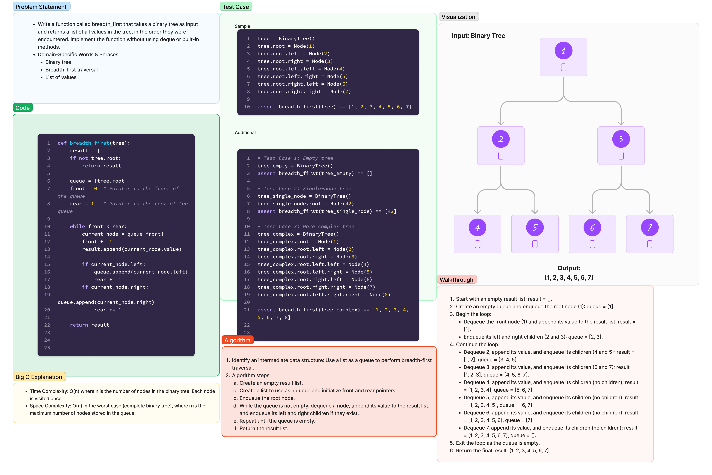

# Challenge 17 - Tree Breadth First

Write a function called `breadth_first` that takes a binary tree as input and returns a list of all values in the tree, in the order they were encountered. Implement the function without using `deque` or built-in methods.

Domain-Specific Words & Phrases:

- Binary tree
- Breadth-first traversal
- List of values

## Date - 1.30.24

## Whiteboard Process



[Code](../../code_challenges/tree_breadth_first.py)

## Approach & Efficiency

I utilized a breadth-first traversal approach to visit each level of the binary tree before moving to the next level. The algorithm uses a list as a queue to manage the nodes and processes them in the order encountered.

**Big O Analysis:**

- Time Complexity: O(n), where n is the number of nodes in the binary tree. Each node is visited once.

- Space Complexity: O(n) in the worst case (complete binary tree), where n is the maximum number of nodes stored in the queue.

## Solution

To run the code, you can use the `breadth_first` function by passing an instance of the `BinaryTree` class as an argument. Here's an example:

```python
from data_structures.binary_tree import BinaryTree, Node
from code_challenges.tree_breadth_first import breadth_first

# Example usage:
tree = BinaryTree()
tree.root = Node(1)
tree.root.left = Node(2)
tree.root.right = Node(3)
tree.root.left.left = Node(4)
tree.root.left.right = Node(5)
tree.root.right.left = Node(6)
tree.root.right.right = Node(7)

result = breadth_first(tree)
print(result)
```

This will output: `[1, 2, 3, 4, 5, 6, 7]`, representing the breadth-first traversal of the given binary tree.
