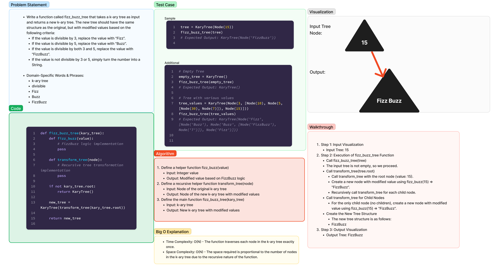

# Challenge 18 - Tree Fizz Buzz

Description

Implement a function to perform a FizzBuzz transformation on a k-ary tree, replacing values that are divisible by 3, 5, or both with "Fizz", "Buzz", or "FizzBuzz", respectively.

## Date - 1.31.24

## Whiteboard Process

Here's the whiteboard representation of the solution:

[Code](../../code_challenges/tree_fizz_buzz.py)

## Approach & Efficiency

In the `tree_fizz_buzz.py` file, the `fizz_buzz_tree` function takes a k-ary tree as input and performs a FizzBuzz transformation on each node, creating a new tree with the transformed values.

### Approach

1. Define a helper function `fizz_buzz` to determine the FizzBuzz transformation for a given value.
2. Define a recursive helper function `transform_tree` to traverse the original tree, applying the FizzBuzz logic to each node and creating a new tree with the transformed values.
3. Create a new k-ary tree instance (`new_tree`) and assign the root of the transformed tree to it.

### Efficiency

- Time Complexity: O(N) - The function traverses each node of the k-ary tree once.
- Space Complexity: O(N) - The space required is proportional to the number of nodes in the k-ary tree.

**Big O Analysis:**

- Time complexity is linear because we visit each node exactly once.
- Space complexity is also linear due to the recursive nature of the function and the creation of the new tree.

## Solution

The provided code in `tree_fizz_buzz.py` solves the FizzBuzz transformation for a k-ary tree.

