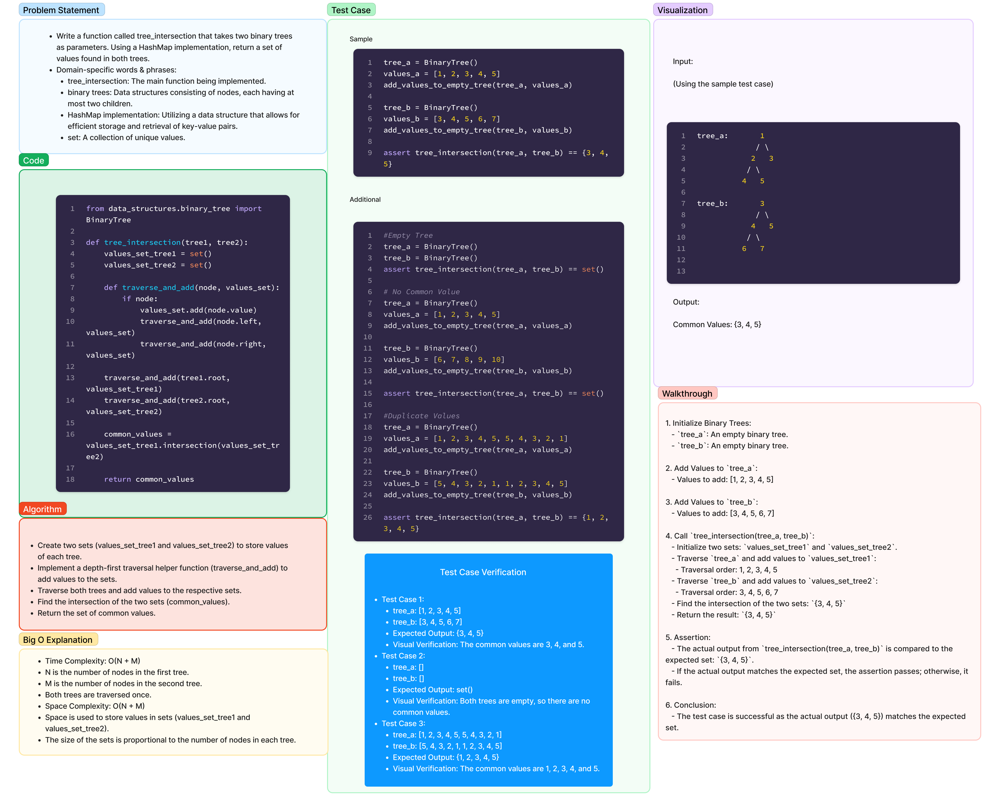

# Code Challenge 32: Binary Trees

- Write a function called `tree_intersection` that takes two binary trees as parameters.

- Using your Hashmap implementation as a part of your algorithm, return a set of values found in both trees.

Date: 2.19.24

## Whiteboard Process

[](intersection.png)

[Code](../../code_challenges/tree_intersection.py)

## Approach & Efficiency

For this code challenge, I implemented the `tree_intersection` function using a Hashmap. The algorithm involves traversing both binary trees simultaneously and keeping track of the values encountered in each tree using Hashmaps. By doing this, we can efficiently determine the common values between the two trees.

### Algorithm Steps:

1. Create Hashmaps to store the values encountered in each tree.
2. Traverse both trees simultaneously using any traversal method (e.g., in-order, pre-order, post-order).
3. For each node in both trees:
    - Add the node's value to the respective Hashmap for that tree.
    - Check if the value already exists in the other tree's Hashmap. If it does, add it to the result set.
4. Return the set of common values.

### Efficiency:

- Time Complexity: O(N) where N is the number of nodes in the larger tree, as we need to visit each node once.

- Space Complexity: O(N) for storing values in Hashmaps.

## Solution

To use the `tree_intersection` function, simply call it with two binary trees as parameters. Here's an example:

```python
from binary_tree import BinaryTree
from tree_intersection import tree_intersection

# Create two binary trees
tree1 = BinaryTree()
tree1.insert(1)
tree1.insert(2)
tree1.insert(3)

tree2 = BinaryTree()
tree2.insert(2)
tree2.insert(3)
tree2.insert(4)

# Find the common values
result = tree_intersection(tree1, tree2)

print(result)  # Output: {2, 3}
```

## Resources

- [Binary Trees](https://en.wikipedia.org/wiki/Binary_tree)
- [Hashmap](https://en.wikipedia.org/wiki/Hash_table)
- [Tree Intersection](https://en.wikipedia.org/wiki/Tree_intersection)

